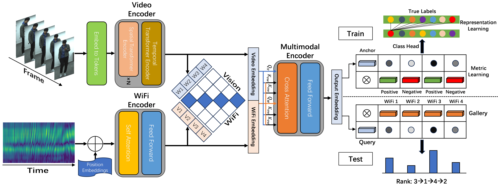

# ViFi-ReID

<b>ViFi-ReID: A Two-Stream Vision-WiFi Multimodal Approach for Person Re-identification</b>

This repository contains the official python implementation for our paper "ViFi-ReID: A Two-Stream Vision-WiFi Multimodal Approach for Person Re-identification, Chen Mao". 
Our paper are available at [here](https://arxiv.org/abs/2406.01906).

<div align="center"></div>

## Introduction

Person re-identification (ReID) emerges as a crucial technology within the security domain, playing an indispensable role in safety detection and personnel counting among others. Present ReID schemes primarily rely on extracting features from images, rendering them vulnerable to disruptions by objective factors such as appearance, clothing, and occlusions. Integrating data from multiple sensors and exploring the correlation of heterogeneous data can effectively expand the perceptual range and enhance the accuracy of ReID. Beyond cameras, we utilize commonly available routers as sensing devices, capturing pedestrian gait through the Channel State Information (CSI) from WiFi signals as a data source. 

<div align="center"></div>

We employ a two-stream network to separately address video understanding and signal analysis tasks, conducting multimodal fusion on pedestrian video and WiFi data to generate comprehensive feature embeddings through advanced objective functions. Concurrently, the model employs contrastive learning to explore the correspondence between the two modalities, enabling cross-modal retrieval of disparate data types. Furthermore, we develop a challenging dataset comprising both videos and signals of persons. Extensive real-world experiments demonstrate that our approach outperforms state-of-the-art unimodal methods in multimodal settings and is capable of effectively bridging the gap between visual and signal modalities. It is applicable in both unimodal and multimodal contexts, thereby expanding the scope of ReID tasks.

## Cite
Here is the bibtex to cite our arxiv paper, the Springer version will be cited after official publication.
```
@ARTICLE{2024arXiv240601906M,
       author = {{Mao}, Chen and {Hu}, Jingqi},
        title = "{ProGEO: Generating Prompts through Image-Text Contrastive Learning for Visual Geo-localization}",
      journal = {arXiv e-prints},
     keywords = {Computer Science - Computer Vision and Pattern Recognition, Computer Science - Information Retrieval},
         year = 2024,
        month = jun,
          eid = {arXiv:2406.01906},
        pages = {arXiv:2406.01906},
          doi = {10.48550/arXiv.2406.01906},
archivePrefix = {arXiv},
       eprint = {2406.01906},
 primaryClass = {cs.CV},
       adsurl = {https://ui.adsabs.harvard.edu/abs/2024arXiv240601906M},
      adsnote = {Provided by the SAO/NASA Astrophysics Data System}
}
```

Parts of this repo are inspired by [fast-reid](https://github.com/JDAI-CV/fast-reid).
